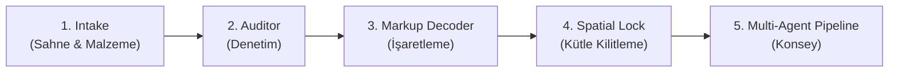

# 🏗️ Archilya Render — Kapsamlı Özellik İncelemesi

## Genel Mimari Özeti

Archilya Render, mimarlık ofislerine yönelik **5 aşamalı bir render pipeline** olarak tasarlanmış. Akış şu şekilde ilerliyor:



| Modül | Dosya Sayısı | Amaç |
|---|---|---|
| **Intake** | 3 bileşen + store | Sahne yükleme, malzeme paleti, ışık tercihi |
| **Auditor** | 3 bileşen + store + engine | Intake verisi denetimi, eksiklik raporlama |
| **Markup Decoder** | 4 bileşen + store | Fabric.js canvas üzerinde annotation, constraint tanımlama |
| **Spatial Lock** | 5 bileşen + store | Mock depth map, metric calibration, sahne tutarlılığı |
| **Pipeline** | 7 bileşen + store | Multi-agent simülasyonu, quality gate, final çıktı |

---

## ✅ Güçlü Yönler — Piyasa İçin Değerli Olan

### 1. Profesyonel İş Akışı Tasarımı
- **5 aşamalı pipeline** mimarlık pratiğine çok uygun. Müşteri brief → denetim → işaretleme → ölçüm → render akışı, mimarlık ofislerinin gerçek iş süreçlerini taklit ediyor.
- Her aşamada **quality gate** (kalite kapısı) var — kullanıcı her aşamayı onaylayıp ileri geçiyor. Bu, "batch and pray" yaklaşımından çok daha profesyonel.

### 2. Zengin Audit (Denetim) Sistemi
- 17 farklı audit kuralı (`INP-001` → `ATM-003`) ile kapsamlı denetim.
- Critical/Warning ayrımı kullanıcıyı yönlendiriyor.
- Sahne, malzeme, kadraj, ışık ve atmosfer tutarlılığı tek elden kontrol ediliyor.

### 3. Markup Decoder — Mimarlara Özel İşaretleme
- **Fabric.js** tabanlı canvas ile sahne üzerinde doğrudan çizim (daire, ok, serbest çizim, metin).
- Annotation → Constraint dönüşümü ile "burayı değiştir" tarzı talimatları yapısal veriye çeviriyor.
- Bu özellik rakiplerde nadir bulunuyor — mimarlara çok doğal bir iletişim aracı sunuyor.

### 4. Spatial Lock — Ölçek Güvencesi
- Depth map üretimi + before/after slider karşılaştırma.
- Volume Score ve Aspect Ratio hesaplamaları ile mekânsal tutarlılık kontrolü.
- Çoklu sahne arasında tutarlılık matrisi (consistency score).

### 5. Multi-Agent Pipeline Konsepti
- 6 farklı ajan rolü (Orkestratör, Analist, Malzeme, Render, QC, Revizyon).
- Canlı mesaj akışı ve stage tracker ile süreç şeffaflığı.
- Revizyon feedback formu ile geriye dönük düzeltme imkanı.

### 6. Teknik Kalite
- TypeScript tip güvenliği baştan sona korunmuş.
- Context API ile temiz state management (5 ayrı store).
- i18n desteği (`next-intl`) ile çok dilde hazırlık.
- Framer Motion ile profesyonel animasyonlar.

---

## ⚠️ Kritik Geliştirilmesi Gereken Alanlar

### 🔴 Kritik Seviye — Piyasaya Çıkmadan Önce Çözülmeli

#### 1. Tamamen Mock Backend — Gerçek Render Yok
> **En büyük eksik.** Pipeline tamamen simülasyon.

- `mock-pipeline-runner.ts` hardcoded mesajlar gönderiyor, gerçek bir AI/render motoru çağrılmıyor.
- `mock-depth-generator` kullanılıyor — gerçek bir depth estimation modeli (MiDaS, DPT, vb.) entegre değil.
- `pairScore()` fonksiyonu sahneler arasında tutarlılığı gerçek analiz yerine **karakter toplamı** ile hesaplıyor — bu tamamen sahte.
- `buildMetricLock()` fonksiyonu aspect ratio'yu `scene.imageFile ? 1.5 : 1.33` gibi hardcoded veriyor — gerçek görsel boyutunu okumuyor.
- Final output viewer sadece mevcut görsele gradient overlay koyuyor — render çıktısı üretilmiyor.

```typescript
// BU SAHTE — gerçek bir ölçüm değil
function pairScore(firstId: string, secondId: string) {
  const seed = `${firstId}:${secondId}`
    .split("")
    .reduce((total, char) => total + char.charCodeAt(0), 0);
  return 75 + (seed % 21);  // Her zaman 75-95 arası random
}
```

**Öneri:** `nano-banana-service.ts`'deki gerçek AI servislerine (`analyzeArchitectural`, `transformStyle`, `generateEnhancedRender`) bağlanması gerekiyor. Bu servisler zaten var ama Render modülü bunları kullanmıyor.

#### 2. Moodboard ve Client Reference UI'ı Yok
Intake store'da `moodboards` ve `clientReferences` tanımlı ama arayüzde hiçbir yerde yükleme/görüntüleme yok. Mimarlık ofisleri için moodboard kritik bir araç.

#### 3. State Kaybı — Sayfa Yenilemede Her Şey Sıfırlanıyor
Tüm state'ler `useState` ile tutuluyor. Sayfayı yenileyince tüm yüklenmiş sahneler, malzemeler, markup'lar silinir. Tarayıcı çökmesi veya yanlışlıkla sayfa kapatma durumunda iş kaybı yaşanır.

**Öneri:** En azından `localStorage` veya `IndexedDB` ile otomatik draft kayıt. İleri seviyede Firestore'a draft persistance.

#### 4. `approveSta` Adlandırma Hatası
Pipeline store'daki `approveSta` fonksiyonu isim hatası ("approveStage" olmalı). Hem `approveSta` hem `approveStage: approveSta` olarak ikili alias yapılmış — bu refactoring eksikliği gösteriyor.

---

### 🟡 Orta Seviye — Kullanıcı Deneyimini Ciddi Etkileyen

#### 5. Drag & Drop ile Sahne Sıralama Yok
`reorderScenes()` fonksiyonu store'da var ama arayüzde drag-and-drop sıralama implementasyonu yok. Mimarlar sahneleri sürükleyerek sıralayamıyor.

#### 6. Fabric Canvas Responsive Değil
Canvas boyutu `width: 860, height: 560` olarak hardcoded. Mobil/tablet veya dar ekranlarda kullanılamaz.

#### 7. Markup Decoder'da Sahne Görseli Arka Plan Sorunu
`FabricCanvas` bileşeninde `sceneImagePreview` CSS `background-image` olarak atanıyor ama canvas üzerine `fabric.Image` olarak eklenmemiş. Bu şu sorunlara yol açıyor:
- Zoom/pan yapıldığında arka plan sabit kalıyor (annotation kayması).
- Export edildiğinde arka plan dahil edilmiyor.
- Canvas boyutu ile görsel boyutu farklı olduğunda ölçek uyumsuzluğu.

#### 8. İndir/Kaydet Butonları Çalışmıyor
`FinalOutputViewer`'daki "İndir" ve "Projeye Kaydet" butonları sadece `type="button"` ile tanımlanmış, hiçbir `onClick` handler'ı yok.

#### 9. Geri Alma (Undo) Sınırlı
Markup store'da `undoAnnotation()` sadece son eklenen annotation'ı kaldırıyor. Redo yok, history stack yok. Mimarlar karmaşık işaretlemelerde bu çok kısıtlayıcı.

#### 10. Hardcoded Türkçe Stringler
Çok sayıda buton ve etiket doğrudan Türkçe yazılmış (`"Denetleniyor"`, `"Var"`, `"Yok"`, `"Markup'a Geç"` vb.) — `useTranslations` hook'u kullanılmamış. i18n'in yarım kaldığını gösteriyor.

---

### 🟢 İyileştirme Fırsatları — Rekabet Avantajı Sağlayacak

#### 11. Sahne Karşılaştırma (Before/After) Zayıf
Depth map viewer'daki before/after slider sadece 80px yüksekliğinde. Final output viewer'daki ise gerçek çıktı yerine gradient overlay gösteriyor. Bu, ürünün en "wow" anı olmalı — şu an çok mütevazı.

#### 12. Progress/Timeline Gösterimi Yetersiz
Pipeline'ın toplam ne kadar süreceğine dair bir tahmin yok. Stage tracker sadece durumu gösteriyor ama kullanıcıya "3 dk kaldı" gibi feedback vermiyor.

#### 13. Çoklu Render Versiyonu Yok
Kullanıcı farklı stiller veya parametrelerle birden fazla render versiyonu oluşturup karşılaştıramıyor. Mimarlık ofisleri genelde 2-3 alternatif sunum yapar.

#### 14. Çözünürlük/Format Seçimi Yok
Final çıktı için çözünürlük (HD, 4K), format (PNG, TIFF, PSD), aspect ratio seçimi yok. Profesyonel sunum için kritik.

#### 15. Toplu İşlem (Batch Render) Yok
8 sahne yüklenebiliyor ama hepsinin tek seferde render'lanması için bir mekanizma yok — her sahne ayrı ayrı pipeline'dan geçmeli.

---

## 📊 Piyasa Karşılaştırması

| Özellik | Archilya Render | Midjourney | Kaiber | Lumion | Enscape |
|---|:---:|:---:|:---:|:---:|:---:|
| Mimarlık-spesifik iş akışı | ✅ | ❌ | ❌ | ✅ | ✅ |
| Sahne-üzeri annotation | ✅ | ❌ | ❌ | ❌ | ❌ |
| Audit/denetim sistemi | ✅ | ❌ | ❌ | ❌ | ❌ |
| Gerçek-zamanlı render | ❌ | ❌ | ❌ | ✅ | ✅ |
| AI-bazlı render | 🟡* | ✅ | ✅ | ❌ | ❌ |
| Mekânsal tutarlılık kontrolü | ✅ | ❌ | ❌ | ✅ | ✅ |
| Multi-agent şeffaflığı | ✅ | ❌ | ❌ | ❌ | ❌ |
| Batch render | ❌ | ✅ | ✅ | ✅ | ✅ |
| 4K+ çıktı | ❌ | ✅ | ✅ | ✅ | ✅ |

*🟡 = Backend servisleri mevcut (`nano-banana-service.ts`) ama Render modülüne entegre değil.*

---

## 🎯 Kullanım Senaryosu Analizi

### Mevcut Akış (Mimar Perspektifinden)

```
1. Mimar 3-4 sahne görseli yükler (iç/dış mekan fotoğrafları)
2. Malzeme referansları ekler (zemin, duvar karoları)
3. Işık/atmosfer seçer (golden hour, bulutlu vb.)
4. Auditor denetimden geçirir → eksikler raporlanır
5. Markup Decoder'da "burayı değiştir" işaretlemeleri yapar
6. Spatial Lock'ta derinlik haritası oluşturur, kütleyi kilitler
7. Pipeline başlatılır → mock simülasyon çalışır
8. Final çıktı gösterilir → gradient overlay (gerçek render yok)
```

### Sorunlu Noktalar
- **Adım 5-6** çok teknik. Ortalama bir mimar "depth map" veya "volume score" kavramlarına yabancı. Bu terminoloji basitleştirilmeli.
- **Adım 7** gerçek render üretmiyor — kullanıcı "Konsey'i Başlat" butonuna basıp sahte mesajlar izliyor.
- **Adım 8** gerçek bir çıktı sunmuyor. Bu noktada kullanıcı hayal kırıklığına uğrar.

---

## 🛣️ Önerilen Yol Haritası

### Faz 1 — MVP Tamamlama (Acil)
1. ~~Mock~~ → Gerçek `nano-banana-service.ts` entegrasyonu (en az `transformStyle` + `generateEnhancedRender`)
2. State persistence (localStorage/IndexedDB draft kayıt)
3. `approveSta` → `approveStage` temizliği
4. İndir/Kaydet butonlarının çalışır hale getirilmesi
5. Hardcoded Türkçe string'lerin `tr.json`'a taşınması
6. Moodboard yükleme arayüzü

### Faz 2 — Kullanıcı Deneyimi İyileştirme
7. Fabric Canvas'ı responsive yapma
8. Sahne görseli'ni canvas üzerine `fabric.Image` olarak ekleme
9. Drag & drop sahne sıralama
10. Undo/Redo history stack
11. Depth map viewer'ı full-size before/after yapma
12. Progress tahmin süresi gösterimi

### Faz 3 — Piyasa Rekabeti
13. Çoklu render versiyonu karşılaştırma
14. Çözünürlük/format seçimi (HD, 4K, PNG, TIFF)
15. Batch render desteği
16. "Spatial Lock" aşamasını daha mimar-dostu dile çevirme
17. Client-facing sunum modu (müşteriye paylaşılabilir link)

---

## 🏆 Sonuç

**Archilya Render, konsept olarak piyasadaki en sofistike mimarlık-spesifik render iş akışına sahip.** 5 aşamalı pipeline, annotation sistemi, audit engine ve multi-agent konsepti — bu mimaride piyasadaki hiçbir rakipte yok.

**Ancak şu an bir "interaktif demo/prototip" aşamasında.** Gerçek render motoru (AI veya geleneksel) entegre edilmeden, state persistence olmadan ve çıktı indirme/kaydetme çalışmadan ticari kullanıma sunulamaz.

**En stratejik hamle:** `nano-banana-service.ts`'deki mevcut AI servislerini pipeline'a bağlamak. Backend altyapı hazır, sadece frontend entegrasyonu eksik. Bu yapıldığında "prototype" → "MVP" geçişi tamamlanmış olur.

> [!IMPORTANT]
> Özellik listesi olarak %85 hazır, fonksiyonel olarak %40 hazır. Backend servis katmanı zaten var — öncelik bu bağlantının kurulması.
