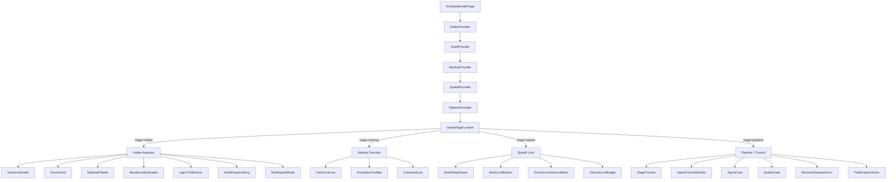

# Archilya Render — Detaylı Özellik Analizi

**Tarih:** 16 Mayıs 2026  
**Kapsam:** Sadece Archilya Render özelliği (`/archilya-render` rotası)  
**Toplam Dosya Sayısı:** ~45 dosya · ~3.800 satır kod

---

## 1. Genel Mimari Haritası



### 4 Aşamalı İş Akışı

| # | Aşama | Amaç | Bileşen Sayısı |
|---|-------|------|----------------|
| 1 | **Intake** | Sahne yükleme, malzeme/moodboard seçimi, ışık tercihi | 4 bileşen + 3 auditor |
| 2 | **Markup Decoder** | Fabric.js canvas ile sahne üstü annotation + constraint | 4 bileşen |
| 3 | **Spatial Lock** | Depth map, metrik kalibrasyon, tutarlılık matrisi | 5 bileşen |
| 4 | **Pipeline / Council** | Multi-agent simülasyonu, kalite kapısı, final çıktı | 7 bileşen |

---

## 2. Dosya ve Katman Envanteri

### 2.1 State Management (5 Store)

| Store | Dosya | Satır | State Alanları | Kalıcılık |
|-------|-------|-------|----------------|-----------|
| `intake-store` | `stores/intake-store.tsx` | 278 | scenes, materials, moodboards, clientRefs, lightPref | ✅ localStorage |
| `audit-store` | `stores/audit-store.tsx` | 58 | auditReport, isAuditing, canProceed | ❌ Yok |
| `markup-store` | `stores/markup-store.tsx` | 163 | annotations, constraints, undo/redo stack | ❌ Yok |
| `spatial-store` | `stores/spatial-store.tsx` | 89 | depthMaps, metricLocks, consistencyResult | ❌ Yok |
| `pipeline-store` | `stores/pipeline-store.tsx` | 253 | jobState, agents, stages, approval | ❌ Yok |

### 2.2 Type Definitions (5 dosya)

| Dosya | İçerik |
|-------|--------|
| `lib/types/scene.ts` | Scene, MaterialRef, Moodboard, ClientReference, LightPreference, IntakeState + sabitler |
| `lib/types/markup.ts` | Annotation, Constraint, MarkupTool, MarkupSession |
| `lib/types/audit.ts` | AuditRule, AuditViolation, AuditReport |
| `lib/types/spatial.ts` | DepthMap, MetricLock, ConsistencyResult, SpatialSession |
| `lib/types/agent.ts` | AgentRole, AgentState, PipelineStage, JobState |

### 2.3 Logic Layer (4 dosya)

| Dosya | Satır | Amaç |
|-------|-------|------|
| `lib/validators/audit-engine.ts` | 143 | 18 kural ile intake validasyonu |
| `lib/utils/mock-pipeline-runner.ts` | 78 | Mock multi-agent pipeline simülasyonu |
| `lib/utils/mock-depth-generator.ts` | 45 | Canvas gradient ile sahte depth map |
| `lib/transformers/markup-to-json.ts` | 26 | Annotation → Constraint JSON dönüşümü |

### 2.4 Sabitler

| Dosya | İçerik |
|-------|--------|
| `lib/constants/audit-rules.ts` | 18 audit kuralı (6 CRITICAL, 12 WARNING) |
| `lib/constants/mock-intake.ts` | 3 sahne, 3 malzeme, 2 moodboard, 1 referans mock veri |

---

## 3. Güçlü Yönler ✅

### 3.1 Mimari

- **Temiz aşama ayrımı:** 4 aşama birbirinden bağımsız, her biri kendi store'unda state yönetiyor
- **Provider nesting:** Tüm store'lar `page.tsx`'te tek noktada compose ediliyor
- **Type-safe:** Tüm aşamalar için ayrı type dosyaları, strict TypeScript
- **i18n desteği:** Intake aşaması `next-intl` ile çevrilebilir
- **Blob URL sanitization:** `sanitizePreview()` ile localStorage'dan blob URL'leri temizleniyor — memory leak önlemi

### 3.2 UI/UX

- **Drag & drop sahne sıralama:** SceneUploader'da native HTML drag API
- **Fabric.js canvas entegrasyonu:** Profesyonel annotation aracı (freehand, circle, arrow, text, eraser)
- **Undo/redo:** 30 seviye geri alma desteği (markup-store)
- **Before/after slider:** Depth map ve final output'ta karşılaştırma slider'ı
- **Responsive grid:** Tüm aşamalarda responsive layout
- **Agent card animasyonları:** Thinking dots, progress bar, canlı mesaj akışı

### 3.3 Validasyon

- **18 audit kuralı:** İyi yapılandırılmış, her kural code + severity + message + fixGuidance içeriyor
- **Dosya validasyonu:** MIME type, boyut limiti (20MB), maks sahne sayısı (8) kontrolleri
- **Audit gateway:** Critical hata varsa Markup'a geçiş engelleniyor

### 3.4 Test Altyapısı

- **`mvp.manual.test.tsx`:** 8 test case, jsdom ortamı, i18n provider ile render
- **Kapsam:** localStorage draft, blob sanitization, drag-drop, undo/redo, depth map, pipeline ETA, spatial lock

---

## 4. Kritik Sorunlar ve Riskler 🚨

### 4.1 🔴 Tüm Pipeline Mock — Gerçek AI Entegrasyonu Yok

Pipeline tamamen `mock-pipeline-runner.ts` ile simüle ediliyor. Gerçek bir AI servisi çağrılmıyor.

```typescript
// mock-pipeline-runner.ts — Hardcoded mesajlar
const stageMessages = {
  1: [
    { role: "ORCHESTRATOR", content: "Sahne analizi başlatılıyor...", messageType: "thought" },
    { role: "ANALYST", content: "Salon - Kuzey: İç mekan, orta derinlik", messageType: "result" },
  ],
  // ...
};
```

> [!IMPORTANT]
> Pipeline'daki 6 agent (ORCHESTRATOR, ANALYST, MATERIAL, RENDER, QC, REVISION) hepsi mock. Gerçek bir arka uç servisi bağlanmadan bu özellik production-ready değil.

**Etki:** Kullanıcı pipeline'ı başlattığında önceden yazılmış Türkçe mesajları görüyor. Gerçek render üretilmiyor.

### 4.2 🔴 Depth Map Sahte — Canvas Gradient Overlay

```typescript
// mock-depth-generator.ts
const horizontalGradient = context.createLinearGradient(0, 0, canvas.width, canvas.height);
horizontalGradient.addColorStop(0, "rgba(13, 27, 42, 0.82)");
horizontalGradient.addColorStop(0.45, "rgba(108, 99, 255, 0.66)");
horizontalGradient.addColorStop(1, "rgba(46, 213, 115, 0.52)");
```

Depth map gerçek bir depth estimation modeli (MiDaS, ZoeDepth vb.) kullanmıyor, sadece gradient overlay.

### 4.3 🔴 Consistency Matrix Deterministik — Gerçek Analiz Yok

```typescript
// scene-consistency-matrix.tsx
function pairScore(firstId, secondId) {
  const seed = `${firstId}:${secondId}`.split("").reduce((total, char) => total + char.charCodeAt(0), 0);
  return 75 + (seed % 21); // Her zaman 75-95 arası sabit skor
}
```

Tutarlılık skoru sahne ID'lerinin charCode toplamından türetiliyor, gerçek görsel karşılaştırma yapılmıyor.

### 4.4 🔴 FinalOutputViewer Firebase Callable Çağırıyor — Ama Mock'lara Bağımlı

```typescript
// final-output-viewer.tsx
import { generateEnhancedRender, transformStyle } from "@/services/nano-banana-service";
```

FinalOutputViewer `nano-banana-service` üzerinden gerçek Firebase callable çağırıyor. Ancak test'te bu servis mock'lanmış. Production'da çalışacak ama Pipeline aşamasının geri kalanı mock olduğu için tutarsızlık yaratıyor.

### 4.5 🔴 Stage Geçişi URL'ye Yansımıyor

```typescript
const [stage, setStage] = useState<"intake" | "markup" | "spatial" | "pipeline">("intake");
```

Aşama geçişleri `useState` ile yönetiliyor, URL'ye yansımıyor. Kullanıcı:
- Sayfayı yenilerse Intake'e düşer
- Tarayıcı geri tuşu çalışmaz
- Deep link paylaşılamaz

### 4.6 🟡 Markup/Spatial/Pipeline State Kalıcı Değil

Sadece Intake store localStorage'a yazıyor. Kullanıcı Markup'ta annotation yaptıktan sonra sayfayı yenilerse tüm çalışması kaybolur.

| Store | Kalıcılık |
|-------|-----------|
| intake-store | ✅ localStorage |
| audit-store | ❌ RAM-only |
| markup-store | ❌ RAM-only — Tüm annotation'lar kaybolur |
| spatial-store | ❌ RAM-only — Depth map ve lock'lar kaybolur |
| pipeline-store | ❌ RAM-only — Pipeline ilerlemesi kaybolur |

### 4.7 🟡 Hardcoded Türkçe Metinler (i18n Eksik)

Intake aşaması `useTranslations()` kullanıyor ama diğer 3 aşamada birçok hardcoded Türkçe string var:

| Bileşen | Hardcoded Örnekler |
|---------|-------------------|
| `audit-progress-ring.tsx` | "Denetim çalışıyor", "tick tick kontrol ediliyor" |
| `red-report-modal.tsx` | "Kırmızı Çizgi Denetmeni", "Geri Dön ve Düzelt" |
| `markup-decoder-page.tsx` | "Kritik Okuyucu", "Intake'e Dön", "Constraint'e Dönüştür" |
| `spatial-lock-page.tsx` | "Kütle Kilitleme", "Konsey'e Gönder" |
| `pipeline-page.tsx` | "Multi-Agent Pipeline", "Konsey'i Başlat" |
| `quality-gate.tsx` | "Onayla ve Devam Et", "Revize Talep Et" |
| `constraint-list.tsx` | "Constraint Paneli", "İşaretleme Okuması" |
| `metric-calibration.tsx` | "Kütle Ölçümü", "Kilitlendi", "Kütleyi Kilitle" |

### 4.8 🟡 `window.setTimeout` ile Audit Simülasyonu

```typescript
// page.tsx L44-56
window.setTimeout(() => {
  const report = runAudit({ scenes, materials, ... });
  completeAudit(report);
  setIsReportOpen(report.criticalCount > 0);
}, 1250);
```

`runAudit` senkron bir fonksiyon olmasına rağmen 1.25 saniye yapay gecikme ekleniyor. Bu UX açısından iyi (loading hissi) ama:
- Timeout ID temizlenmiyor (memory leak riski)
- Component unmount olursa state güncellemesi hata verebilir

### 4.9 🟡 Fabric Canvas — Çoklu useEffect Karmaşası

`fabric-canvas.tsx` (389 satır) 6 farklı `useEffect` içeriyor. Bunların dependency array'leri çok geniş:

```typescript
// L230 — annotations, canvasSize, constraints, sceneId, sceneImagePreview hepsi dependency
useEffect(() => { ... }, [annotations, canvasSize, constraints, sceneId, sceneImagePreview]);
```

Her annotation eklendiğinde tüm canvas clear + rebuild oluyor. Performans sorunu yaratabilir.

### 4.10 🟡 SceneCard'da Blob URL Yanlış Revoke

```typescript
// scene-card.tsx L54-58
const handleRemove = () => {
  if (scene.imagePreview) {
    URL.revokeObjectURL(scene.imagePreview); // ⚠️ data: URL'ler revoke edilemez
  }
  removeScene(sceneId);
};
```

`readAsDataURL` ile oluşturulan preview'lar `data:` ile başlar, `blob:` ile değil. `URL.revokeObjectURL` bu durumda sessizce başarısız olur. `SceneUploader` bunu doğru yapıyor (`preview?.startsWith("blob:")` kontrolü) ama `SceneCard` yapmıyor.

---

## 5. Performans Değerlendirmesi

### 5.1 Bundle Impact

| Bağımlılık | Tahmini Boyut | Kullanım Yeri |
|------------|---------------|---------------|
| `fabric` | ~300KB gzipped | Sadece Markup aşaması |
| `framer-motion` | ~35KB gzipped | Tüm aşamalar |
| `next/image` | Built-in | Scene/Material kartları |

> [!TIP]
> `fabric` büyük bir kütüphane. Zaten `dynamic(() => import(...), { ssr: false })` ile lazy load ediliyor — bu doğru yaklaşım.

### 5.2 Re-render Analizi

| Store | Re-render Riski | Nedeni |
|-------|----------------|--------|
| `intake-store` | 🟡 Orta | 20+ değer tek Context'te, her değişiklikte tüm consumer'lar render |
| `markup-store` | 🔴 Yüksek | `annotations` array her değişiklikte yeni referans → canvas rebuild |
| `pipeline-store` | 🟡 Orta | Agent mesajları sık güncelleniyor |

### 5.3 localStorage Veri Boyutu

Intake draft, sahne görsellerini `base64` olarak saklıyor:
```typescript
// intake-store.tsx L123
window.localStorage.setItem(INTAKE_DRAFT_STORAGE_KEY, JSON.stringify(draft));
```

8 sahne × ~2MB base64 = ~16MB localStorage yazımı. Tarayıcıların localStorage limiti genellikle 5-10MB. Bu **sessiz bir hata** ile sonuçlanabilir.

---

## 6. Güvenlik Değerlendirmesi

| Alan | Durum | Not |
|------|-------|-----|
| Dosya tipi validasyonu | ✅ İyi | MIME type + boyut kontrolü |
| Server-side validasyon | ❌ Yok | Tüm validasyon client-side |
| Firebase Firestore kaydı | ❌ Yok | Render sonuçları Firestore'a kaydedilmiyor |
| Kredi kontrolü | ❌ Yok | Render işlemi için kredi düşümü yok |
| Rate limiting | ❌ Yok | Pipeline tekrar tekrar başlatılabilir |
| Input sanitization | 🟡 Kısmen | Dosya adları label olarak kullanılıyor, XSS riski düşük (React escape) |

---

## 7. Test Kapsamı

### 7.1 Mevcut Testler (`mvp.manual.test.tsx`)

| Test | Kapsam |
|------|--------|
| localStorage draft persistence | ✅ Intake store |
| Final output localStorage save | ✅ Pipeline output |
| Scene direction i18n keys | ✅ Type helper |
| Stale blob preview rejection | ✅ Store sanitization |
| Drag-drop scene reorder | ✅ SceneUploader |
| Markup undo/redo | ✅ Markup store |
| Depth map comparison layout | ✅ DOM class check |
| Pipeline ETA display | ✅ Pipeline page |
| Consistency score (single scene) | ✅ Spatial store |
| Spatial lock → pipeline proceed | ✅ End-to-end flow |

### 7.2 Eksik Test Senaryoları

| Senaryo | Öncelik |
|---------|---------|
| Audit engine — tüm 18 kuralın coverage'ı | 🔴 Yüksek |
| Max scene/material limitleri | 🔴 Yüksek |
| Dosya validasyonu (geçersiz MIME, boyut aşımı) | 🟡 Orta |
| Fabric canvas annotation CRUD | 🟡 Orta |
| Pipeline revision request flow | 🟡 Orta |
| FinalOutputViewer error handling | 🟡 Orta |
| localStorage quota exceeded | 🟢 Düşük |

---

## 8. Önceliklendirilmiş Eylem Planı

### Faz 3A — Kritik Altyapı (Hemen)

| # | Eylem | Dosya | Süre |
|---|-------|-------|------|
| 1 | **Stage'i URL'ye yansıt** — `searchParams` veya nested route ile | `page.tsx` | 2s |
| 2 | **Markup/Spatial/Pipeline state'i localStorage'a yaz** | 3 store dosyası | 3s |
| 3 | **setTimeout cleanup** — useEffect ile unmount guard | `page.tsx` L44 | 30dk |
| 4 | **localStorage base64 taşması** — `imagePreview`'ları draft'a yazmayı kes, sadece metadata sakla | `intake-store.tsx` | 1s |
| 5 | **SceneCard blob revoke düzeltmesi** | `scene-card.tsx` L54 | 15dk |

### Faz 3B — i18n ve Hardcode Temizliği (1-2 Gün)

| # | Eylem | Dosya Sayısı | Süre |
|---|-------|-------------|------|
| 6 | **Tüm Türkçe hardcode'ları `t()` ile değiştir** | ~12 bileşen | 4s |
| 7 | **`messages/tr.json` ve `messages/en.json`'a Render key'lerini ekle** | 2 dosya | 2s |

### Faz 3C — Gerçek AI Entegrasyonu (Haftalık)

| # | Eylem | Süre |
|---|-------|------|
| 8 | **Mock pipeline runner → gerçek Firebase callable entegrasyonu** | 8s |
| 9 | **Mock depth generator → MiDaS/ZoeDepth API entegrasyonu** | 4s |
| 10 | **Consistency matrix → gerçek CLIP/SSIM karşılaştırma** | 4s |
| 11 | **Kredi sistemi entegrasyonu** — render başlatmadan önce kredi kontrolü | 2s |

### Faz 3D — Performans ve Polish (İlerleyen)

| # | Eylem | Süre |
|---|-------|------|
| 12 | **Fabric canvas yeniden render optimizasyonu** — incremental update | 3s |
| 13 | **Store'ları ayır** — intake store'u selector pattern ile böl | 2s |
| 14 | **Audit engine unit testleri** — tüm 18 kuralı kapsayan test suite | 3s |
| 15 | **Firestore'a kaydetme** — render session'ı proje ile ilişkilendirme | 4s |

---

## 9. Özet Skor Kartı

| Kategori | Skor | Not |
|----------|------|-----|
| **Mimari Kalite** | 8/10 | Temiz aşama ayrımı, iyi tip güvenliği |
| **Kod Kalitesi** | 7/10 | Tutarlı stil, bazı küçük hatalar |
| **UI/UX Tasarım** | 8/10 | Premium dark theme, güzel animasyonlar |
| **Fonksiyonel Bütünlük** | 4/10 | Pipeline, depth map, consistency hep mock |
| **Test Kapsamı** | 6/10 | Temel flow'lar test edilmiş, edge case'ler eksik |
| **i18n Hazırlığı** | 4/10 | Sadece intake aşaması hazır |
| **Production Hazırlığı** | 3/10 | Mock bağımlılıklar, state kalıcılığı eksik |
| **Güvenlik** | 5/10 | Client-only validasyon, server-side kontrol yok |

> [!WARNING]
> Archilya Render'ın mimari iskeleti ve UI kalitesi gayet iyi, ancak **gerçek AI arka ucu olmadan bu özellik demo/prototype seviyesinde**. Faz 3A'daki altyapı düzeltmeleri hemen yapılabilir; gerçek AI entegrasyonu ise planlı sprint çalışması gerektirir.
